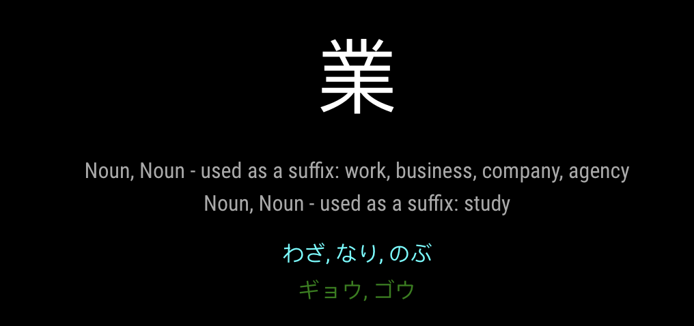

# MMM-Kanji-Random
This an extension for the [MagicMirror](https://github.com/MichMich/MagicMirror).

This module displays the Kanji content using two sources:
   - http://kanji.fm4dd.com/ (to grab a random Kanji, based on simple criteria).
   - http://jisho.org/ (the undocumented API to lookup definitions of specific Kanji).

On a regular basis (by default hourly, more or less), this will retrieve
a random Kanji character and display the definition and readings. Kun readings
are shown in cyan. On readings are shown in green. The kanji character will
be displayed in orange if it is an uncommon kanji. Note that this is based
on the Jisho API saying that the kanji is not common, however I'm not convinced
on the interpretation of that field, since it says things like 試 is uncommon,
while the full web interface says it's #392 out of the 2500 most used kanji
in newspapers...

The Jisho API is awesome, but not quite polished yet. This means that it provides
a wealth of information (much of which is not displayed, since there's a vast amount
of info there!). It does provide more thorough meanings of Kanji compared
to the data found from the random kanji service, however the API readings are
a little broken, so this module will always display the readings that came
from the random kanji service. I hope that as the API improves, this service
can cutover more data from there.

## Example



## Installation
Open a terminal session, navigate to your MagicMirror's `modules` folder and execute `git clone https://github.com/njwilliams/MMM-Kanji-Random.git`. 
A new folder called MMM-Kanji-Random will be created. In that folder, run 'npm install' to ensure that dependent packages are available..

Activate the module by adding it to the config.js file as shown below.

## Using the module
````javascript
modules: [
{
  module: 'MMM-Kanji-Random',
  position: 'middle-center',
  config: {
    type: "JLPT",
    level: "N4",
    minsBeforeChange: 180, // let's leave it up for a few hours
  }
},
````

## Configuration options

The following properties can be configured:

| **Option** | **Values** | **Description** |
|---|---|---|
| type | random, elementary, jlpt, minna no nihongo | Selects the source of the Kanji. Random will pick from all of the sources and has no other options. If one of the other types is chosen, then the level option must also be provided |
| level | N1-N5, 1-6, 1-2 | Sets the level of the given type. JLPT uses "N1", "N2", etc. Elementary grades are 1 through 6. Minna No Nihongo just has 1 and 2 |
| minsBeforeChange | 60 | How many minutes before the Kanji is changed. The default is 60 (i.e. hourly). |

