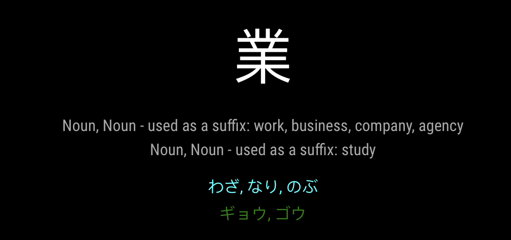

# MMM-Kanji-Random
This an extension for the [MagicMirror](https://github.com/MichMich/MagicMirror).

This module displays the Kanji content from a local dataset of common
words, combined with  http://jisho.org/ (the API to lookup definitions of specific Kanji).

On a regular basis (by default hourly, more or less), this will retrieve
a random Kanji character and display the definition. Furigana is
are shown in cyan. The kanji character will
be displayed in orange if it is an uncommon kanji. Note that this is based
on the Jisho API saying that the kanji is not common, however I'm not convinced
on the interpretation of that field, since it says things like 試 is uncommon,
while the full web interface says it's #392 out of the 2500 most used kanji
in newspapers...

The Jisho API is awesome, but not quite polished yet. This means that it provides
a wealth of information (much of which is not displayed, since there's a vast amount
of info there!). It does provide more thorough meanings of Kanji compared
to the local data.

## Example



## Installation
Open a terminal session, navigate to your MagicMirror's `modules` folder and execute `git clone https://github.com/njwilliams/MMM-Kanji-Random.git`. 
A new folder called MMM-Kanji-Random will be created. In that folder, run 'npm install' to ensure that dependent packages are available..

Activate the module by adding it to the config.js file as shown below.

## Using the module
````javascript
modules: [
{
  module: 'MMM-Kanji-Random',
  position: 'middle-center',
  config: {
    level: "N4",
    minsBeforeChange: 180, // let's leave it up for a few hours
  }
},
````

## Configuration options

The following properties can be configured:

| **Option** | **Values** | **Description** |
|---|---|---|
| level | N1-N5 | Sets the difficulty/commonality of the vocabulary. N5 is the simplest. N1 is more advanced. Only words of the given rating will be shown. |
| minsBeforeChange | 60 | How many minutes before the Kanji is changed. The default is 60 (i.e. hourly). |


## Source

The vocabulary dataset comes from the Tanos JLPT website (https://www.tanos.co.uk/jlpt/sharing/), where it is made available under the CC BY license.
